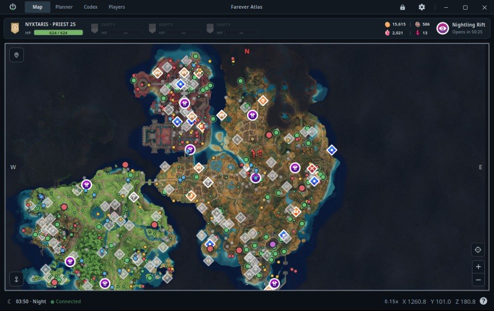
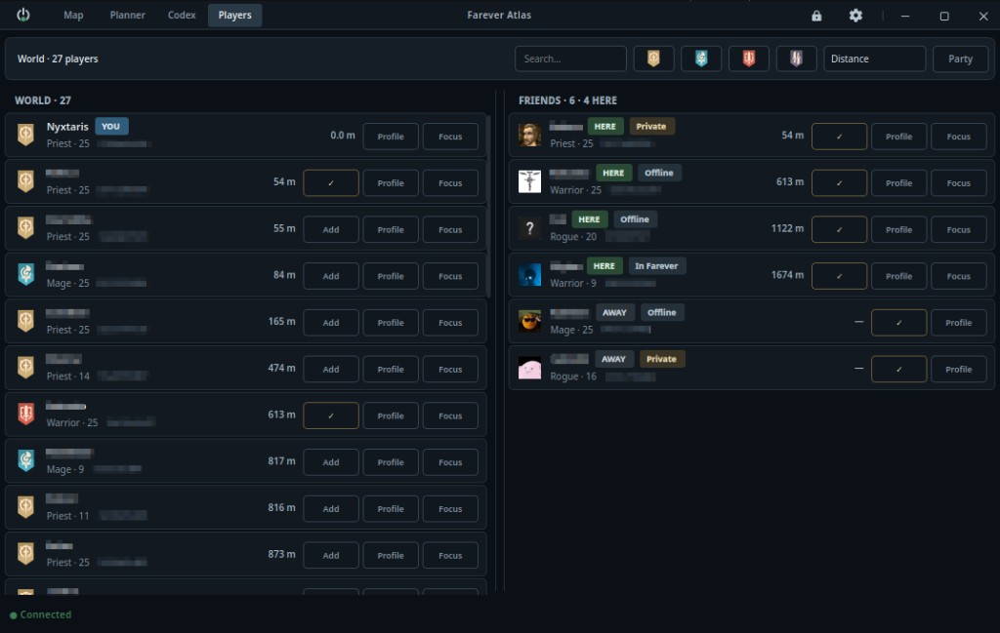
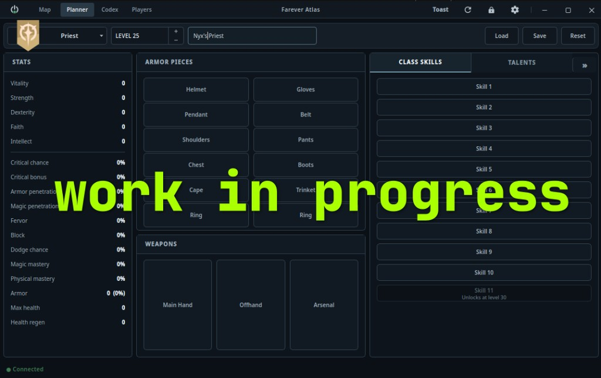
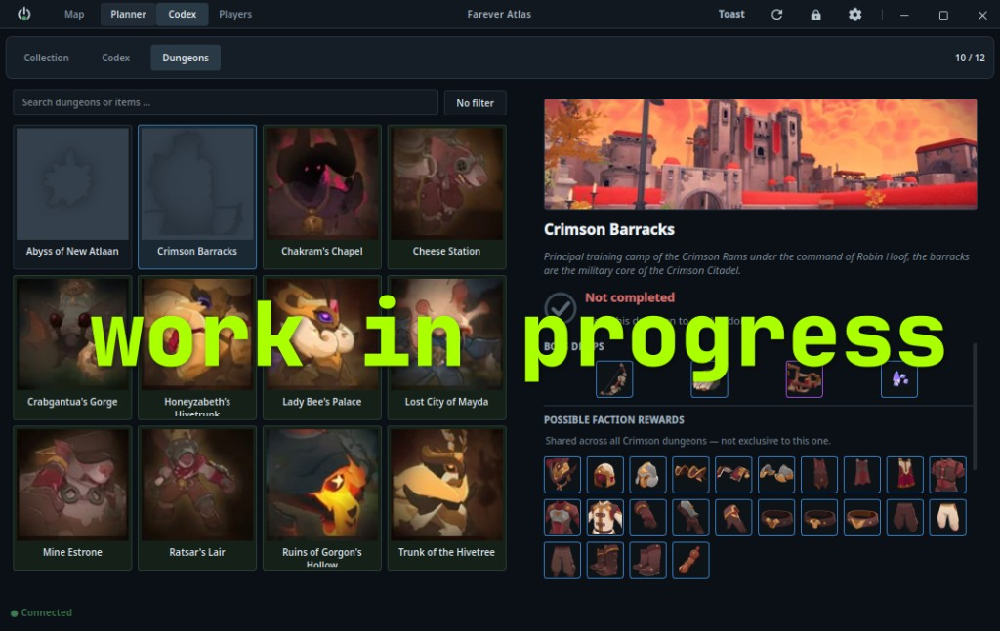

# Farever Atlas

[](https://github.com/wdymUsername/FareverAtlas/actions/workflows/windows-portable.yml)
[](https://github.com/wdymUsername/FareverAtlas/releases/tag/Nightly)
[](https://github.com/wdymUsername/FareverAtlas/releases/tag/Nightly)

**Farever Atlas** is a standalone map and companion app for **Farever**.

It shows useful live game information in its own window and optional overlay,
while keeping game access **read-only**.

> Start Farever and log in to a character before launching Atlas.

---

## Download

### Windows

**[Download the latest Nightly](https://github.com/wdymUsername/FareverAtlas/releases/tag/Nightly)**

Run `FareverAtlas.exe`. No installation or Python required.

### Linux / Proton

```bash
./farever setup
./farever start
```

`setup` creates the venv, installs deps, and builds the native bridge. Run it
again after pulling updates so the bridge stays up to date.

Start Farever through Steam and log in before `start`.

---

## Features

Atlas is actively developed, so features and UI may change between releases.

Current highlights include:

- **World Map** — live position, party, nearby players, enemies, critters,
  POIs, loot, waypoints, destination route lines and map filters
- **Overlay** — currently a click-through minimap (positioning, locking,
  game-follow); more overlay parts are WIP and land after the matching feature
  works properly in the main app
- **NODE GUIDE** — navigation to nearby resources, chests, Red Orbs, critter
  spawns and other supported targets
- **Fog of War** — hides unavailable, inaccessible or unreleased parts of the
  world map
- **Party** — party status, distance and map positions
- **Players & Friends** — instance roster, local friends, player tracking and
  optional Steam integration
- **Game Info** — Gold, Craft Points, Demonic Soul, Nightblood, game time, day
  cycle and Nightling Rift timer

New features and improvements are added regularly. Check the
[Nightly releases](https://github.com/wdymUsername/FareverAtlas/releases/tag/Nightly)
for the current build.

<details>
<summary><strong>Screenshots</strong></summary>

<br>

More screenshots live in [`media/screenshots/`](media/screenshots/).

**Map**



**Players**



**Planner** (work in progress)



**Codex** (work in progress)



</details>

---

## NODE GUIDE

NODE GUIDE finds the nearest target matching your selected filters and draws a
destination line to it.

When you reach or collect that target, it can automatically move on to the
**next matching target**.

> **Navigation only — no botting.**

Atlas does not move your character, press keys, click, collect items or
otherwise play the game for you.

---

## Work in Progress

More companion features are being developed, including:

- **DPS / Combat Meter** — UI is present and reads an extremely rough
  nearby-foe health delta; numbers should not be taken at face value, and this
  is not a real combat log or skill breakdown
- Overlay beyond the minimap (after the matching main-app feature is solid)
- Planner
- Codex
- Richer combat / target details
- Additional navigation and companion tools

Some unfinished UI can be previewed with:

```bash
./farever start --dev
```

`--dev` unlocks experimental pages such as the **Planner** and **Codex**, plus
dev QoL (Reload / Toast) and fog-of-war layer / bake editing. Expect unfinished
features to be incomplete, broken or change without warning.

---

## Is Atlas Safe?

Atlas reads Farever's memory to get live information such as your position,
health, nearby actors and world objects.

It **only reads** that information.

Atlas does not:

- Write to game memory
- Inject code into Farever
- Automate gameplay
- Control your keyboard or mouse
- Modify Farever's files
- Send game memory over the network

Atlas also checks whether the running Farever version is supported. If the game
changes after an update, Atlas stops reading rather than guessing where the data
moved.

Technical details are available in
[`native_bridge/README.md`](native_bridge/README.md).

---

## Antivirus Warnings

Some antivirus programs may flag `FareverAtlas.exe` or its included bridge.

There are several reasons Atlas is more likely than a typical desktop app to
trigger antivirus heuristics:

- **Memory access** — Atlas reads another running program's memory. Debuggers,
  modding tools, cheats and malware can use similar methods, so memory-reading
  software is often treated with extra suspicion.
- **Standalone `.exe` packaging** — the Windows version is a bundled Python
  application. This packaging method is also used by some malware and can cause
  heuristic detections.
- **No code signing** — Atlas is not Authenticode-signed and will not be.
  Certificate cost is not worth it for this project, so Windows and antivirus
  services have less publisher reputation to work with.
- **Nightly builds** — every build produces a new file hash. Fresh files have
  little reputation or scan history, which makes false positives more likely.

The bridge only requests **read access** to Farever. It does not request
permission to write to game memory or inject code.

### Verify your download

Download Atlas only from the official:

**[Farever Atlas — Nightly](https://github.com/wdymUsername/FareverAtlas/releases/tag/Nightly)**

Each release provides:

- `FareverAtlas.exe`
- A matching `.sha256` file
- A VirusTotal scan for that build

Make sure any hash or VirusTotal result you check belongs to the **exact build
you downloaded**.

If antivirus quarantines Atlas, verify the build before restoring it or adding
an exclusion.

---

## Launcher Commands

### Linux

```bash
./farever setup
./farever start
./farever stop
./farever restart
```

### Windows source build

```bat
farever.bat setup
farever.bat start
farever.bat stop
farever.bat restart
```

---

## Contributing

See [`CONTRIBUTING.md`](CONTRIBUTING.md).
